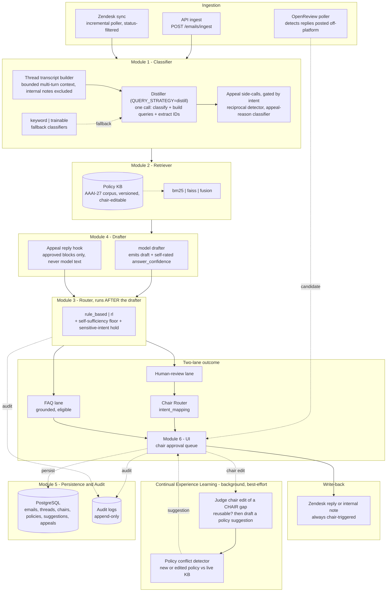
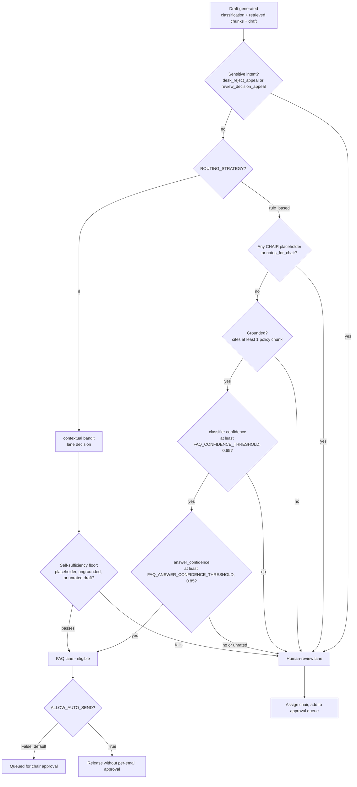
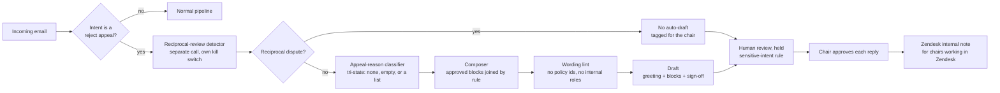
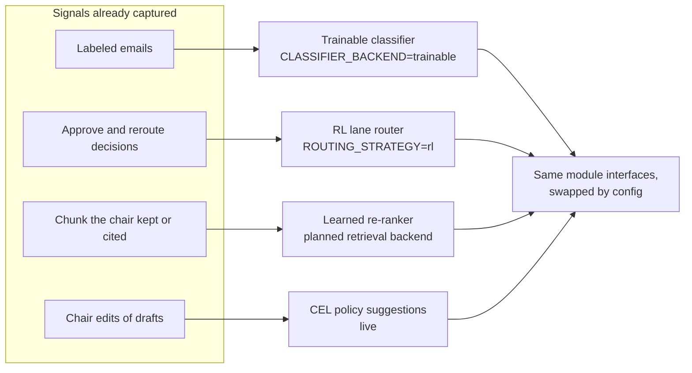

# ConfMail — Automated Conference Email Reply & Routing System

> An AI-powered email management platform for academic conference organizations. Built at the **Melady Lab, USC**, piloting live on **AAAI-27**, with NeurIPS / ICML / ICLR as longer-term targets.


**Jump to:** [Overview](#overview) · [Architecture](#architecture) · [Reject-appeal handling](#reject-appeal-handling) · [Configuration](#configuration) · [Getting started](#getting-started) · [Production deployment](#production-deployment) · [Status & roadmap](#status--roadmap)

---

## Overview

Conference program chairs receive thousands of emails per cycle: deadline questions, formatting queries, reviewer-assignment issues, appeals, and CMS support requests. Most are repetitive and answerable from public policy documents. A minority need genuine human judgment. ConfMail separates the two automatically.

| Lane | What lands here | What happens |
|---|---|---|
| **FAQ lane** | Replies that are fully grounded, self-contained, and high-confidence | Eligible for auto-reply. Every claim traces to a retrieved policy chunk, with no invented policy. Auto-send is **off** in production, so a chair still approves each one. |
| **Human-review lane** | Novel, ambiguous, low-confidence, sensitive, or incomplete emails | Routed to the responsible chair with an AI draft, the full conversation thread, cited policy sources, and extracted submission context. The chair **approves, edits, or reroutes**, and every action is audited. |

This began as a research MVP and is now a **live production pilot**. The core modules (classifier, retriever, drafter, router, chair router, persistence, UI) remain separate, config-swappable components. Around them sits a chair-facing product surface: Zendesk sync with write-back, OpenReview reply detection, thread-aware reprocessing, policy-conflict detection, a continual-learning loop, and a template-based reject-appeal workflow. It runs against the **real AAAI-27 policy corpus** on AAAI's own server.

### What a demo reviewer should take away

| Question | Where to look |
|---|---|
| How are emails classified? | Ticket view → **Classification** panel (intent, family, confidence) |
| How does policy retrieval work? | Ticket view → **Policy citations** (clickable, with full text and version lineage) |
| Why was this routing decision made? | Ticket view → **Routing rationale** (gate-by-gate explanation) |
| How does human review work? | Queue → split-pane ticket → Approve / Edit / Reroute / Add or remove policy |
| What happened and when? | **Audit** timeline; per-ticket **trace** endpoint |
| How does it evolve into a research platform? | [Trainable components](#trainable-components-roadmap) and the active-learning signals |

---

## Architecture

The core modules are independently replaceable. One property matters most: **the router runs *after* the drafter**. FAQ eligibility depends on the *generated draft's* quality (grounded, complete, confident), not on the intent label alone.



### Two-lane routing decision

Where the confidence thresholds, sensitive-intent hold, self-sufficiency floor, and transport gate sit:



> Non-LLM drafters report `answer_confidence = None`, which fails the floor by design, so a draft is never auto-eligible unless a model explicitly rated it. `ALLOW_AUTO_SEND` stays `False` until production sign-off. Today every send requires explicit chair approval.
>
> Both reject-appeal intents are held in human review on purpose. The hold is keyed on intent, which is deliberately over-broad, and it keeps appeal replies out of the FAQ lane until the policy stance is signed off.

### Pipeline module backends

| Module | Backend options | Notes |
|---|---|---|
| **Classifier** | `keyword` · `trainable` | 14-intent taxonomy (5 families) single-sourced in `taxonomy.py`. Trainable backend = sentence embeddings + LogisticRegression, falling back to keyword until trained. |
| **Retriever** | `bm25` · `faiss` · `fusion` | Grounds replies in the versioned, chair-editable AAAI-27 corpus. `bm25` lexical, `faiss` dense (CPU, `IndexFlatIP` cosine), `fusion` reciprocal-rank fusion. **Default `fusion`**. |
| **Router (lane)** | `rule_based` · `rl` | Runs after the drafter. `rl` is an online epsilon-greedy contextual bandit updated on approve/reroute (groundwork; `rule_based` is the default path). |
| **Chair Router** | `intent_mapping` | Second routing decision: which chair owns a human-review email. Falls back to a general chair. A swap seam for a future learned policy. |
| **Drafter** | `anthropic_api` · `anthropic` · `local` · `template` · `fallback` | `local` = any OpenAI-compatible endpoint (self-hosted or hosted); `template` = zero-model, verbatim-grounded; `fallback` = deterministic no-network stub. |
| **Query strategy** | `prefix` · `distill` | `distill` rewrites the email into 1-3 policy-vocabulary queries, classifies intent, and extracts submission/author identifiers in one call. Any failure falls back to keyword classifier + prefix query. **Default `distill`**. |
| **Persistence** | PostgreSQL · SQLite | PostgreSQL in Docker (production and demo). SQLite is the safe local/test default. One async `DATABASE_URL` drives both the app engine and Alembic. |

### Beyond the core pipeline

- **Multi-turn conversation threads.** A ticket's full comment history is stored, rendered as a chat-style thread, and fed to the classifier and drafter as a budget-bounded transcript. Internal notes are excluded from anything sent to a model. Follow-ups trigger whole-thread reprocessing.
- **Quoted-reply hygiene.** `quoted_reply.py` strips the quoted original from replies across several email clients and languages, so drafts see only what the requester wrote.
- **OpenReview reply detection.** A poller and candidate queue catch authors who reply on OpenReview instead of by email. A chair can approve-and-post, mark solved, or dismiss.
- **Chair-controlled policy selection.** A chair can force a specific policy into a draft, or *exclude* policies from retrieval. Exclusions are staged until approval and survive policy edits (they match by lineage root, so re-versioning does not undo them). At least one policy always remains.
- **Re-evaluation on policy change.** When a chair edits the knowledge base, a background sweep re-runs retrieval for open tickets and re-drafts only those whose grounding shifted, without touching a chair's own edits.
- **Policy-conflict detection.** Before a new or edited policy is saved, one model call checks it against the live KB and flags the exact conflicting text.
- **Continual Experience Learning (CEL).** When a chair fills in a `[CHAIR: ...]` gap, a best-effort background job judges whether the edit encodes a reusable policy, runs it through the conflict detector, and files it as a chair-reviewable suggestion.
- **Submission and author extraction.** The distiller's identification of the paper(s) and author(s) an email concerns is validated into a "Submission Details" panel.
- **Active-learning flagging.** Each approve or reroute is checked for a near-miss confidence band or a substantially rewritten draft, and flagged for a future labeling pass. Retraining is never triggered automatically.
- **Queue ergonomics.** Server-side pagination (100 per page), Zendesk status and date-range filters (solved and closed share one bucket), scroll-position restoration, shareable per-ticket URLs, live queue updates over SSE, and keyboard shortcuts.

---

## Reject-appeal handling

After each decision release, the inbox is flooded with appeals. ConfMail handles them with a **separate, deliberately conservative path**. Appeal replies are composed from **chair-approved wording blocks and never written freely by a model**. The pipeline Marc already uses is untouched while the new switches are off.



| Stage | Component | Notes |
|---|---|---|
| **Reciprocal detector** | `reciprocal_detector.py` | A separate call gated on intent, so the main distiller prompt stays byte-identical. Within-gate precision about 0.94, recall 1.0. Kill switch: `RECIPROCAL_DETECTOR_ENABLED`. |
| **Reason classifier** | `appeal_reason_classifier.py` | Tri-state `appeal_reason`. Registry in `appeal_reasons.py`. Escalation grounds are *wrong paper reviewed* and *scores don't match outcome*. Off by default. |
| **Reply blocks** | `data/reply_templates/` | Composable opening, numbered-point, and closing blocks derived from the chairs' own past wording. Hash-pinned. Only approved blocks load, and the cycle must match `APPEAL_REPLY_CYCLE`. |
| **Composer + lint** | `appeal_reply_composer.py`, `appeal_reply_lint.py` | Deterministic merging rules for multi-reason appeals. Never raises. Any failure becomes a chair-writes placeholder. |
| **Drafter hook** | `appeal_reply_hook.py` | Replaces the model drafter for appeals when switched on, and can be limited to a Phase 1 window. Default **off**. |
| **Phase 1 tracking** | `phase1_appeal_classifier.py` | Records each Phase 1 rejection appeal per paper, with CSV export. |
| **Chair notes in Zendesk** | `integrations/zendesk/chair_note`, `paper_apc_resolver.py` | Looks up the paper's chair and posts the approved draft as a labelled *internal note* so chairs without ConfMail access can copy it. Backend pieces are built and inert. Posting will be a manual button, not automatic. |

Design history is in [`docs/exp_tracking/reject_appeal.md`](docs/exp_tracking/reject_appeal.md) (decision log D1-D134).

---

## Configuration

All backend behavior is env-driven (`backend/.env`, see `backend/.env.example`). Defaults below are the **code defaults** from `app/core/config.py`.

### Swappable module seams

| Flag | Options | Controls | Default |
|---|---|---|---|
| `MODEL_PROVIDER` | `anthropic_api` · `anthropic` · `local` · `template` · `fallback` | Drafter backend | `anthropic_api` ¹ |
| `CLASSIFIER_BACKEND` | `keyword` · `trainable` | Classifier backend | `keyword` |
| `RETRIEVAL_BACKEND` | `bm25` · `faiss` · `fusion` | Retriever backend | `fusion` |
| `QUERY_STRATEGY` | `prefix` · `distill` | Retrieval-query build, intent, and extraction | `distill` |
| `ROUTING_STRATEGY` | `rule_based` · `rl` | Lane router | `rule_based` |
| `CHAIR_ROUTING_STRATEGY` | `intent_mapping` | Which chair a human-review email goes to | `intent_mapping` |

### Routing and confidence tuning

| Flag | Type | Controls | Default |
|---|---|---|---|
| `CONFIDENCE_THRESHOLD` | float | General classifier-confidence floor | `0.75` |
| `FAQ_CONFIDENCE_THRESHOLD` | float | Min classifier confidence for the FAQ lane | `0.65` |
| `FAQ_ANSWER_CONFIDENCE_THRESHOLD` | float | Min drafter self-rated confidence for the FAQ lane | `0.85` |
| `CALIBRATION_ENABLED` | bool | Use a fitted confidence calibrator when present | `False` |
| `INTENT_PRIOR_ENABLED` | bool | Soft intent-to-KB retrieval prior (regressed fusion in eval, kept off) | `False` |
| `ALLOW_AUTO_SEND` | bool | Let complete FAQ drafts release without per-email approval | `False` |
| `AL_CONFIDENCE_MARGIN` / `AL_EDIT_RATIO` | float | Active-learning near-miss and meaningful-edit thresholds | `0.15` / `0.15` |

### Reject-appeal and chair-note switches

| Flag | Type | Controls | Default |
|---|---|---|---|
| `RECIPROCAL_DETECTOR_ENABLED` | bool | Separate reciprocal-review detector call | `True` |
| `APPEAL_REASON_CLASSIFIER_ENABLED` | bool | Appeal-reason classifier | `False` |
| `APPEAL_REPLY_COMPOSER_ENABLED` | bool | Draft appeals from approved blocks instead of the model (needs the reason classifier) | `False` |
| `APPEAL_REPLY_WINDOW_END` | datetime? | Limit composed wording to Phase 1 rejections | `None` |
| `APPEAL_REPLY_CYCLE` | str | Conference cycle the approved blocks must belong to | `AAAI-27` |
| `PHASE1_APPEAL_ENABLED` / `_START` / `_INTENT` | bool / datetime? / str | Record Phase 1 appeals per paper | `False` / `None` / `review_decision_appeal` |
| `CHAIR_NOTE_ENABLED` | bool | Chair-note posting to Zendesk (pieces built, inert) | `False` |
| `CHAIR_NOTE_INTENTS` | str | Intents in scope, fails closed on a typo | `review_decision_appeal,desk_reject_appeal` |
| `CHAIR_NOTE_TICKET_IDS` | str | Optional allow-list for a scoped live trial | empty |
| `CHAIR_NOTE_MAX_PER_CYCLE` | int | Max notes per sync cycle | `20` |

### Retriever, drafter, and thread tuning

| Flag | Type | Controls | Default |
|---|---|---|---|
| `MAX_RETRIEVED_CHUNKS` | int | Grounding chunks returned | `5` |
| `WARM_RETRIEVER_ON_STARTUP` | bool | Build index and load the embed model at startup | `True` |
| `FAISS_MODEL_NAME` | str | CPU sentence-embedding model for `faiss` and `fusion` | `all-MiniLM-L6-v2` |
| `THREAD_TRANSCRIPT_MAX_CHARS` | int | Character budget for the multi-turn transcript | `16000` |
| `DRAFTER_MAX_TOKENS` | int | Max tokens per reply (sized for reasoning models) | `2500` |
| `DRAFTER_TEMPERATURE` / `DRAFTER_SEED` | float / int | Drafter determinism | `0.0` / `7` |
| `DRAFT_MODEL` | str | Hosted drafter model id (when `anthropic_api`) | *configurable* ² |
| `LOCAL_MODEL_BASE_URL` | str | OpenAI-compatible endpoint | `http://localhost:11434/v1` |
| `LOCAL_MODEL_NAME` | str | Model id (when `local`) | *configurable* ² |
| `LOCAL_MODEL_API_KEY` | str? | Optional bearer token for a keyed endpoint | `None` |
| `STYLE_GUIDE_PATH` | str? | Reply style guide appended to the drafter prompt | `../data/style_guide/style_guide_v2.md` |

### Secrets, database, Zendesk, and OpenReview

| Flag | Options / type | Controls | Default |
|---|---|---|---|
| `ANTHROPIC_API_KEY` | secret | Cloud API key (only for `anthropic_api`) | `None` |
| `DATABASE_URL` | str | Single async DB URL (app engine and Alembic) | SQLite ³ |
| `ZENDESK_AUTH_MODE` | `token` · `oauth` | Credential provider | `token` ⁴ |
| `ZENDESK_SUBDOMAIN` | str? | Account subdomain | `None` |
| `ZENDESK_EMAIL` / `ZENDESK_API_TOKEN` | str? | Basic-auth fields (`token` mode) | `None` |
| `ZENDESK_OAUTH_CLIENT_ID` / `_SECRET` | str? | OAuth client credentials (`oauth` mode) | `None` |
| `ZENDESK_OAUTH_SCOPE` | str | Scope for sending | `read` |
| `ZENDESK_SYNC_OAUTH_SCOPE` | str | Scope for the ingest poller, **read-only** by design | `read` |
| `ZENDESK_POLLING_ENABLED` | bool | Background ingest loop (manual `POST /zendesk/sync` works regardless) | `False` |
| `ZENDESK_POLL_INTERVAL_SECONDS` | int | Seconds between poll cycles | `300` |
| `ZENDESK_SYNC_START_TIME` | int | Unix epoch for the first incremental pull | `1` |
| `ZENDESK_SYNC_PER_PAGE` / `ZENDESK_MAX_PAGES_PER_CYCLE` | int | Page size (max 1000) and page bound per cycle | `100` / `10` |
| `ZENDESK_SYNC_STATUSES` | str | Statuses eligible for sync and queue filtering | `new,open,pending,hold,solved,closed` |
| `OPENREVIEW_USERNAME` / `OPENREVIEW_PASSWORD` | str? | Credentials for the reply-detection poller | `None` |
| `OPENREVIEW_BASE_URL` | str | OpenReview API host | `https://api2.openreview.net` |
| `OPENREVIEW_VENUE_ID` | str? | Venue to poll | `None` |

**Notes on defaults**
1. `config.py` defaults to `anthropic_api`. `backend/.env.example` may ship `local` for a no-key quick start. The live pilot runs `local` pointed at a hosted OpenAI-compatible endpoint. Both `anthropic` and `anthropic_api` spellings are accepted.
2. Model ids are read from config and never hardcoded in code, docs, or commits.
3. `config.py` defaults to local SQLite. Under Docker Compose the backend's `DATABASE_URL` is injected as PostgreSQL and overrides `.env`.
4. The code default is `token`. `.env.example` recommends `oauth`, the validated production path.

---

## Tech Stack

### Backend
| Area | Technology |
|---|---|
| Language / API | Python 3.11+ · FastAPI (async) |
| Data / ORM | async SQLAlchemy 2.0 · Alembic migrations · Pydantic v2 · pydantic-settings |
| HTTP / utils | httpx · python-dateutil |

### ML / Retrieval
| Area | Technology |
|---|---|
| Lexical retrieval | rank-bm25 |
| Dense retrieval | faiss-cpu · sentence-transformers (`all-MiniLM-L6-v2`) |
| Classifier / calibration | scikit-learn (LogisticRegression, Platt scaling) · joblib |
| Drafting | Swappable providers: hosted API, OpenAI-compatible (`local`), `template`, `fallback` |
| Query distillation | One-call query rewrite, intent classification, and submission/author identification |
| Continual learning | Best-effort gated model calls for edit-judging (CEL) and conflict detection. Both fail closed: they never raise and never block a send. |

### Frontend
| Area | Technology |
|---|---|
| Framework | Next.js 14 (App Router) · TypeScript |
| Styling / UI | Tailwind CSS v3 · shadcn/ui (Radix) · lucide-react |
| Data / charts | TanStack Query v5 · axios · recharts |
| Testing | Vitest · Testing Library (jsdom) |

**Routes:** `/dashboard` · `/queue` · `/tickets/[id]` · `/auto-replies` · `/openreview-replies` · `/knowledge-base` · `/analytics` · `/audit`

### Infrastructure
| Area | Technology |
|---|---|
| Orchestration | Docker Compose: `postgres:16-alpine` (`db`, loopback-only, healthcheck) + `backend` (`:8000`) + `frontend` (`:3000`) |
| Database | PostgreSQL (asyncpg) · SQLite (aiosqlite) local/test fallback |
| Integrations | Zendesk (OAuth/token providers, incremental sync, status filtering, internal-note and public-reply write-back) · OpenReview (reply-detection poller) |
| CI / tests | GitHub Actions (secret-free, Postgres service) · pytest + pytest-asyncio (`ml` marker) · Vitest |

---

## Getting Started

### Prerequisites
- Docker Desktop (recommended), **or** Python 3.11+ and Node.js 18+ for manual setup.
- No external keys are needed to boot. With no `.env` the backend runs on safe defaults (keyword classifier, BM25, no-key drafter fallback).

### Quick start (Docker Compose)

```bash
docker compose up --build
```

- **backend** → http://localhost:8000 (API docs at `/docs`). Runs `alembic upgrade head` on boot.
- **frontend** → http://localhost:3000
- **db** (PostgreSQL) → `127.0.0.1:5432`, persisted in the `postgres-data` volume.

Override `POSTGRES_USER` / `POSTGRES_PASSWORD` / `POSTGRES_DB` via the shell or a repo-root `.env` (each defaults to `confmail`).

### Manual backend

```bash
cd backend
python -m venv .venv
source .venv/bin/activate          # Windows: .venv\Scripts\activate
pip install -e ".[dev]"
cp .env.example .env               # edit provider and keys as needed
alembic upgrade head
uvicorn main:app --reload
```

### Manual frontend

```bash
cd frontend
npm install
cp .env.example .env.local         # NEXT_PUBLIC_API_URL=http://localhost:8000/api/v1
npm run dev
```

### Seed, test, evaluate

```bash
cd backend
python scripts/seed.py                    # load the toy dataset through the pipeline (not idempotent, run once)
python -m pytest -m "not ml" -v           # fast suite (skips embedding-heavy tests)
python -m pytest -v                       # full suite including ml
python scripts/run_eval.py                # end-to-end eval harness (provider-dependent)

cd ../frontend && npm test                # Vitest component tests
```

> **Docker users:** run database-touching scripts and tests *inside* the container (`docker compose exec backend ...`). Running them with host Python can silently hit a different database.

---

## Production Deployment

### Local development (unchanged)

```bash
docker compose up --build
```

Uses `localhost` defaults throughout. Nothing extra to set.

### Internal / production deployment

The frontend's API URL is compiled into the browser bundle at **build time**, so set it **before** building. A restart alone will not pick up a change.

**1. Set `NEXT_PUBLIC_API_URL`** to a URL the browser can reach (shell env or repo-root `.env`):

```bash
export NEXT_PUBLIC_API_URL=https://your-host.example/api/v1
```

**2. Build and run with the production override:**

```bash
docker compose -f docker-compose.yml -f docker-compose.prod.yml up --build -d
```

The override rebinds backend (`8000`) and frontend (`3000`) to `127.0.0.1`. The `db` service is already loopback-only in the base file. The override uses Compose's `!override`, so it needs **Compose ≥ 2.24**.

### What loopback-only means

The app is reachable **only from the server itself**, for example over an SSH tunnel (`ssh -L 3000:localhost:3000 user@server`) or an IDE port-forward, and **not from the public internet**. This is deliberate for the shared-access AAAI-27 pilot. A reverse proxy with TLS in front of these ports is a separate future piece.

### Pre-deploy notes
- Production `.env` lives on the server only and is never committed. Keep `ALLOW_AUTO_SEND=False` and `ZENDESK_POLLING_ENABLED=False` until sign-off.
- Chairs should be notified before enabling any appeal-related switch, because the sensitive-intent hold visibly changes queue behavior.
- Docker does not isolate by git branch. Inventory containers and volumes (`docker ps -a`, `docker volume ls`) before starting fresh work on a different branch.

---

## Domain Model

**Intents.** 14 labels in 5 families, single-sourced in `taxonomy.py` (see [`docs/INTENT_TAXONOMY.md`](docs/INTENT_TAXONOMY.md)):
`reviewer_assignment` · `review_submission_help` · `paper_bidding` · `author_profile_compliance` · `submission_upload_help` · `submission_requirements` · `submission_format_policy` · `author_list_change` · `review_decision_appeal` · `desk_reject_appeal` · `anonymity_violation` · `reviewer_workload_role` · `committee_invitation` · `cms_support` (fallback).

**Lanes.** `faq` (grounded, eligible) · `human_review` (routed to a chair with an AI draft).

**Chairs.** Program · Diversity & Ethics · Local Arrangements · Publicity/Sponsorship · General (fallback). Each owns a set of intent areas. `Email.assigned_chair_id` records the assignment, and reroutes are audited as a future training signal.

**Core tables.**

| Table | Purpose |
|---|---|
| `Email` / `EmailThreadMessage` | A ticket and its full comment history. Internal notes are stored but never shown to a model. |
| `Chair` | Chairs and their intent areas |
| `PolicyDocument` / `PolicyAuditLog` | Versioned, chair-editable knowledge base with lineage and history |
| `PolicySuggestion` / `SuggestionAuditLog` | CEL proposals with conflict reports and an accept/reject trail |
| `AuditLog` | Append-only record of every approve, edit, reroute, and send |
| `ZendeskSyncState` | Incremental-sync cursor |
| `PaperAssignment` | Which chair owns each submission (loaded from the committee's assignment sheet) |
| `Phase1Appeal` | Per-paper record of Phase 1 reject appeals |
| `ZendeskChairNote` | Queue and claim state for chair notes posted to Zendesk |
| `EmailProcessingResult` | Per-message result table. **Dormant** (see [Status](#status--roadmap)). |

**Appeal reasons** (tri-state: *not asked* / *asked, none apply* / *a list*): wrong paper reviewed · scores do not match outcome · reviewer misunderstanding · and further reasons in `appeal_reasons.py`. Reciprocal-review disputes are tracked by their own flag, never as a reason.

---

## Status & Roadmap

| Area | State |
|---|---|
| Core pipeline (classify → retrieve → draft → route) | ✅ Live on the AAAI server |
| Chair approval workflow, audit, analytics | ✅ Live |
| Zendesk sync and write-back, OpenReview detection | ✅ Live (polling off by design, manual sync) |
| Real AAAI-27 policy corpus, versioned KB, conflict detection, CEL | ✅ Live |
| Forced and excluded policy controls | ✅ Shipped |
| Queue pagination, status and date filters | ✅ Shipped |
| Reject-appeal Phases 0-2: labeling, reciprocal detector, reason classifier | ✅ Built, on `main`, not yet deployed |
| Reject-appeal Phase 3-4: approved reply blocks, composer, lint, drafter hook | ✅ Built behind default-off switches |
| Chair notes in Zendesk | 🔧 Backend pieces built and inert. Reject Appeals queue and manual post button next. |
| Reject-appeal Phase 5: bulk reply queue | 🗓 Planned |
| Zendesk OAuth as ConfMail login, per-chair send identity | 🗓 Planned (fixes "replied as" attribution) |
| Historical-ticket workflow mining, Phase B (113 clusters into retrieval and drafting) | ⏸ Paused pending taxonomy-extension decision |
| Retriever corpus expansion (AAAI.org scraping) | 🗓 Scoped |

### Trainable components roadmap

The architecture is built so each learning component slots in behind a config flag without refactoring:



Also scoped: a local-only deployment path via `MODEL_PROVIDER=local` against a self-hosted GPU endpoint.

---

## Repository Layout

```
backend/
  app/
    api/            FastAPI routes (v1: emails, policies, chairs, appeals, zendesk, analytics, retrieval)
    pipeline/       classifier, distiller, retriever(s), drafter(s), router(s), orchestrator,
                    CEL, conflict detector, appeal modules
    integrations/   zendesk/, openreview/
    repositories/   persistence layer, one repository per aggregate
    db/ models/ core/   ORM models, schemas, config
  migrations/       Alembic versions
  scripts/          seed, eval, labeling, mining, recovery, appeal tooling
  tests/
frontend/src/
  app/              routes (dashboard, queue, tickets, knowledge-base, analytics, audit, ...)
  components/       email/, kb/, dashboard/, layout/, ui/
data/               toy datasets, eval sets, policy corpus, reply templates, style guide
docs/               design docs, intent taxonomy, KB design, Zendesk API notes, exp_tracking/
CLAUDE.md           engineering rules and phase history
```

### Further reading
- [`docs/INTENT_TAXONOMY.md`](docs/INTENT_TAXONOMY.md): the 14-intent taxonomy and its provenance
- [`docs/DRAFTER_ADAPTER_SPEC.md`](docs/DRAFTER_ADAPTER_SPEC.md): model-agnostic drafter contract
- [`docs/LAYERED_KB_DESIGN.md`](docs/LAYERED_KB_DESIGN.md): policy knowledge-base design
- [`docs/REEVALUATE_ON_POLICY_CHANGE_DESIGN.md`](docs/REEVALUATE_ON_POLICY_CHANGE_DESIGN.md): re-drafting on KB edits
- [`docs/ZENDESK_API.md`](docs/ZENDESK_API.md): Zendesk integration notes
- [`docs/exp_tracking/`](docs/exp_tracking/): experiment and decision logs (E001-E013, reject-appeal D1-D134)

---

## Research Context

Developed at the **Melady Lab, University of Southern California** (PI: Prof. Yan), exploring AI pipelines for academic conference operations. Active directions: active learning from chair decisions, online RL routing with human-in-the-loop feedback, learned chair assignment from reroute signal, retrieval-augmented generation grounded in conference policy, continual policy learning from chair edits (CEL), mining historical tickets for workflow patterns, and evaluation of AI-assisted human-in-the-loop workflows.

---

## Contributing

Active research project. For collaborators:
1. Branch from `main` and work in feature branches.
2. Preserve the module interface contracts. Keep classifier / retriever / router / drafter / persistence / UI **separate**.
3. **Do not hardcode model names** anywhere (code, comments, docs, UI, commit messages). Use capability-descriptive identifiers (`anthropic_api`, `local`, `template`, `fallback`).
4. Never commit ticket data or secrets. The local database may contain real personal data.

---

## License

MIT License. See [LICENSE](LICENSE) for details.

*Built for the Melady Lab, USC · Conference Email Automation Research*
